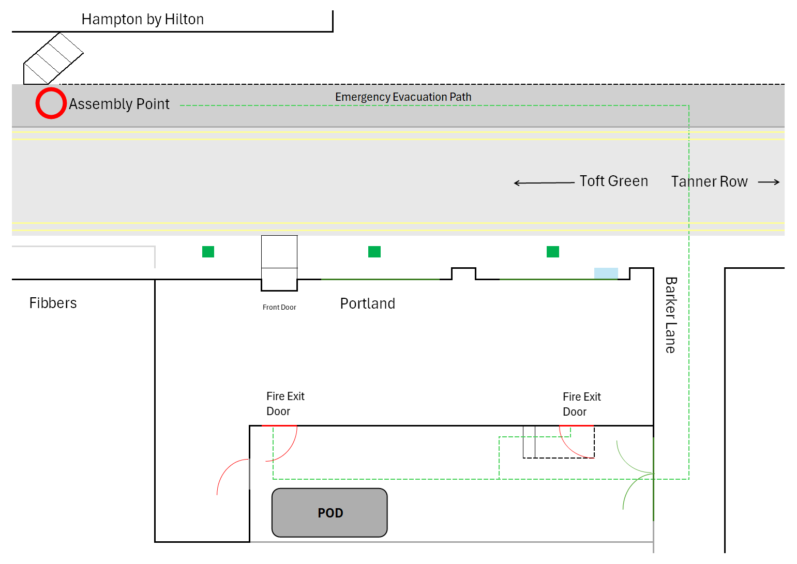

# Fire Evacuation Plan — Summary

### 1. Know Your Building

Before an evacuation is needed, every employee should be familiar with the following:

1. Your nearest exit 
2. A secondary exit route 
3. The assembly point 
4. Fire alarm call points in your area 

### 2. If You Discover a Fire

If you become aware of a fire:

1. **Stay calm.** 
2. **Raise the alarm immediately.** 
3. **Warn others.** 
4. **Evacuate.** 
5. **Report the fire.**

### 3. When You Hear the Alarm

1. **Assume it is a genuine emergency.** 
2. **Stop work immediately.** 
3. **Remain calm and walk briskly.** 

### 4. Leaving the Building

1. Move towards your **nearest safe exit**. 
2. If your nearest exit is blocked or unsafe, use your **secondary exit route**.
3. **Close all doors behind you** as you leave.  
4. Follow any instructions given to you by fire marshals.
5. If you encounter smoke, **stay as low as possible.**
6. If your route is blocked by fire or heavy smoke, turn back and find an alternative exit route.
7. If you become trapped in a room and cannot safely reach an exit:
    - **Close the door** to slow the entry of smoke.
    - Signal for help from a window if one is available.
    - Stay low until help arrives.
8. If you notice a **vulnerable person** or a **visitor or contractor** — offer to guide them towards the exit.

### 5. At the Assembly Point

1. Proceed directly to the **designated assembly point.** 
2. Stay with your **department or team group** 
3. **Participate in the headcount** 
4. If you are aware of anyone on the premises who has **not yet evacuated**, report this to a fire marshal immediately.
5. Keep the area around the building entrances clear. 
6. Remain at the assembly point and stay calm. 

### 6. Do Not

1. Assume the alarm is a false alarm , 2. Go back for personal belongings 3. Put yourself at serious risk to assist others 4. Try to pass through smoke or through a room with a fire 5. Run 6. Prop fire doors open 7. Block the area near building exits 8. Re-enter the building before the all-clear 9. Attempt to fight a fire without training 

