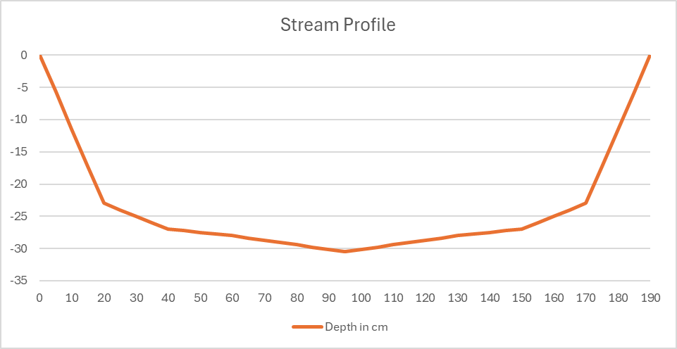

# RO Concentrate Treatment and Disposal Plan

## Stream Assessment for Potential Discharge Location

### Stream Cross-Sectional Profile

The receiving watercourse has been surveyed with the following measurements:

**Stream Width:** 190 cm (1.9 m)

**Measurement Points (from left edge):**
- 0 cm from edge:    0.0 cm depth
- 20 cm from edge:   23.0 cm depth
- 40 cm from edge:   27.0 cm depth
- 60 cm from edge:   28.0 cm depth
- 95 cm from edge:   30.5 cm depth (centre)

(Mirror image on right side - symmetrical U-shape)

### Cross-Sectional Area Calculation

Using the **trapezoidal rule** to calculate the area of one half of the channel, then doubling for total area:

**Left half (0 to 95 cm from edge):**

| Segment | Width (m) | Depth 1 (m) | Depth 2 (m) | Area (m²) |
|---------|-----------|-------------|-------------|-----------|
| 0-20 cm | 0.20 | 0.000 | 0.230 | 0.0230 |
| 20-40 cm | 0.20 | 0.230 | 0.270 | 0.0500 |
| 40-60 cm | 0.20 | 0.270 | 0.280 | 0.0550 |
| 60-95 cm | 0.35 | 0.280 | 0.305 | 0.1024 |

**Calculation formula:** Area = width × (depth₁ + depth₂) / 2

- Segment 1: 0.20 × (0.000 + 0.230) / 2 = 0.0230 m²
- Segment 2: 0.20 × (0.230 + 0.270) / 2 = 0.0500 m²
- Segment 3: 0.20 × (0.270 + 0.280) / 2 = 0.0550 m²
- Segment 4: 0.35 × (0.280 + 0.305) / 2 = 0.1024 m²

**Half channel area:** 0.0230 + 0.0500 + 0.0550 + 0.1024 = **0.2304 m²**

**Total cross-sectional area:** 0.2304 × 2 = **0.4608 m²**

### Stream Flow Rate Calculation

**Flow velocity measurement:**
- Distance travelled: 3.0 metres
- Time taken: 59.17 seconds
- Flow velocity = 3.0 m ÷ 59.17 s = **0.05071 m/s** (5.071 cm/s)

**Volumetric flow rate:**
- Q = Cross-sectional area × Velocity
- Q = 0.4608 m² × 0.05071 m/s
- Q = **0.02337 m³/s**

**Flow rate in litres per day:**
- Q = 0.02337 m³/s × 1,000 L/m³ × 86,400 s/day
- Q = **2,019,168 litres per day**
- Q = **2,019 m³/day** or **2.02 ML/day**

---

## Interim Disposal Arrangements

While awaiting EA permit determination and RO concentrate test results, waste concentrate will be tankered to an approved waste water treatment facility.

### Disposal Facility Details

**Yorkshire Water - Naburn Sewage Treatment Works**
- Address: Naburn S T W, Naburn Lane, Naburn, York, North Yorkshire, YO19 4RN
- Operator: Yorkshire Water Services Limited
- Facility Type: Waste Water Treatment Centre accepting tankered liquid waste

### Disposal Costs

**Treatment Cost:** £9.00 per m³ (charged by Yorkshire Water)

**Haulage Options:**

| Haulage Type | Cost per Load | Load Size |
|--------------|---------------|-----------|
| Internal (own vehicle/driver) | £250.00 | 28 m³ |
| External contractor | £400.00 | 28 m³ |

---

## Monthly Cost Analysis for Interim Disposal

**Basis:** RO system operates 5 days per week (260 working days per year)

The following table shows projected monthly costs for different RO concentrate production rates:

| Daily Volume | Monthly Volume¹ | Monthly Treatment Cost² | Monthly Internal Haulage³ | Monthly External Haulage³ |
|--------------|-----------------|------------------------|--------------------------|--------------------------|
| 10,000 L/day (10 m³/day) | 217 m³ | £1,950.00 | £1,937.50 | £3,100.00 |
| 30,000 L/day (30 m³/day) | 650 m³ | £5,850.00 | £5,812.50 | £9,300.00 |
| 50,000 L/day (50 m³/day) | 1,083 m³ | £9,750.00 | £9,687.50 | £15,500.00 |

**Total Monthly Costs:**

| Daily Volume | Internal Haulage | External Haulage |
|--------------|------------------|------------------|
| 10,000 L/day | £3,887.50 | £5,050.00 |
| 30,000 L/day | £11,662.50 | £15,150.00 |
| 50,000 L/day | £19,437.50 | £25,250.00 |

**Calculation Notes:**

1. **Monthly volume** = Daily volume × 21.67 days (average working days per month: 260 ÷ 12)
2. **Monthly treatment cost** = (Daily volume × 260 working days × £9/m³) ÷ 12 months
3. **Monthly haulage cost** = (⌈Annual volume ÷ 28 m³⌉ × cost per load) ÷ 12 months

**Annual Trip Requirements:**

| Daily Volume | Annual Volume | Trips per Year⁴ |
|--------------|---------------|----------------|
| 10,000 L/day | 2,600 m³ | 93 trips |
| 30,000 L/day | 7,800 m³ | 279 trips |
| 50,000 L/day | 13,000 m³ | 465 trips |

4. **Trips per year** = ⌈Annual volume ÷ 28⌉ (rounded up to nearest whole number)

---

## Notes and Considerations

### Cost-Benefit Analysis
- Interim tankering is a temporary measure with significant ongoing costs
- Based on 5-day working week (260 days/year):
  - At 10,000 L/day, annual tankering costs would be **£46,650** (internal) to **£60,600** (external)
  - At 30,000 L/day, annual tankering costs would be **£139,950** (internal) to **£181,800** (external)
  - At 50,000 L/day, annual tankering costs would be **£233,250** (internal) to **£303,000** (external)
- Direct discharge to stream (if permitted) would eliminate all these costs

### Regulatory Pathway
- Environment Agency permit application required for stream discharge
- Dilution ratio calculation pending RO concentrate test results
- Continuous discharge using buffer tank and dosing pump allows controlled dilution
- Stream flow of ~2.02 ML/day provides substantial dilution capacity

### Next Steps
1. Obtain RO concentrate water quality analysis (TDS, conductivity, pH, specific contaminants)
2. Calculate dilution ratios for various discharge rates
3. Complete EA discharge consent application
4. Implement buffer tank and dosing pump system for controlled discharge
5. Establish discharge monitoring regime as required by permit conditions
